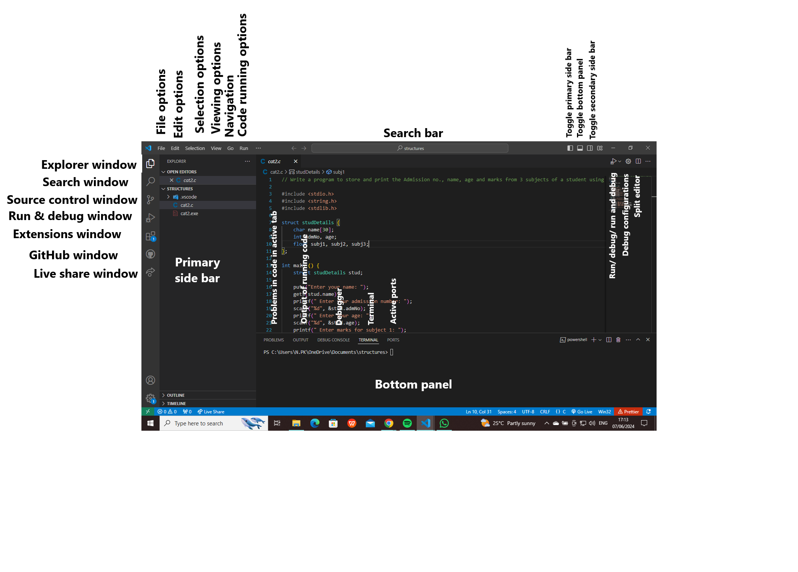

# SE-Assignment-5
Installation and Navigation of Visual Studio Code (VS Code)
Instructions:
Answer the following questions based on your understanding of the installation and navigation of Visual Studio Code (VS Code). Provide detailed explanations and examples where appropriate.

Important things to note:

Please note that any answers in italics are either fully or partially from ChatGPT.
The videos provided are supposed to have audio. If they do not, please contact me via WhatsApp or Telegram (+254 782 514 115).

Questions:

## 1. Installation of VS Code
**Describe the steps to download and install Visual Studio Code on Windows 11 operating system. Include any prerequisites that might be needed.**

### Requirements
- Processor speed of at least 1.6GHz
- At least 1GB of RAM
- Windows 10 or 11 with 64-bit architecture
### Steps
- Download the [Visual Studio Code installer](https://go.microsoft.com/fwlink/?LinkID=534107) for Windows.
- Once it is downloaded, run the installer (VSCodeUserSetup-{version}.exe).
- By default, VS Code is installed under `C:\Users\{Username}\AppData\Local\Programs\Microsoft VS Code`.

[Source](https://code.visualstudio.com/docs/setup/windows)

## 2. First-time Setup
**After installing VS Code, what initial configurations and settings should be adjusted for an optimal coding environment? Mention any important settings or extensions.**

### Initial configurations and settings to be adjusted
- Theme: One should adjust the theme to adjust to what is best for their eyes.
- *Indentation: Set the default indentation to spaces or tabs according to your preference.*
- *Editor Font Size: Adjust the font size for better readability.*
- *Line Numbers: Enable line numbers for easier navigation.*
- *Word Wrap: Decide whether you want lines to wrap or not.*
- *Auto Save: Set auto-save to save your changes automatically.*
- *Cursor Style: Customize cursor style for better visibility.*
- *Extensions Auto Update: Configure whether extensions should be updated automatically.*
- *File Associations: Customize which file types are associated with which language mode.*

### Important extensions
- Prettier: Automatically formats your code to look more presentable.
- Live server: Useful when working with HTML. It enables you to preview your website without using any frameworks.
- Code runner: Runs code.
- Python: Language support for Python. Comes with Pylance IntelliSense, Python debugger, and more useful fetures useful when programming with Python.
- C/C++: Language support for C and C++. Comes with IntelliSense, debugging, and more features useful when programming with C or C++.

## 3. User Interface Overview
**Explain the main components of the VS Code user interface. Identify and describe the purpose of the Activity Bar, Side Bar, Editor Group, and Status Bar.**

Purposes of the:
### Activity Bar
*To provide quick access to various functionalities and views in VS Code. It contains the windows labelled on the leftmost side of the screen.*
### Side Bar
There are two side bars in VSCode; the primary side window, that displays the contents of the windows in the activity bar, and the secondary side bar.
### Editor Group
*The Editor Group is the central area of the VS Code interface where you work with files and write code. It consists of one or more editor tabs, each representing an open file or document. You can have multiple editor groups, allowing you to work on different files side by side or in different layouts.*
### Status Bar
*The Status Bar provides information about the current state of the editor and your project. Information provided includes language mode, line ad column numbers, current Git branch, errors and warnings, encoding, spaces or tabs, line endings and indentation size. In the image above, the status bar is the thin blue strip at the bottom of the editor, just above the computer's taskbar.*

## 4. Command Palette
**What is the Command Palette in VS Code, and how can it be accessed? Provide examples of common tasks that can be performed using the Command Palette.**

*The Command Palette in VS Code is a powerful tool that allows users to access various commands, settings, and features through a searchable interface. It can be accessed by pressing Ctrl+Shift+P (Windows/Linux) or Cmd+Shift+P (Mac).*

Common tasks that can be performed using the command palette include *debugging, committing changes in Git, toggling the terminal and sidebar, opening files, reloading the VS Code window and settings.*

## 5. Extensions in VS Code
**Discuss the role of extensions in VS Code. How can users find, install, and manage extensions? Provide examples of essential extensions for web development.**

Extensions are useful external applications that enhance the user experience and make the coding process easier and more efficient.

Users can find, install and manage extensions in the 'Extensions' window on the activity bar.

Essential extensions for web development include Prettier, Live Server, Code Runner and Tailwind IntelliSense.

## 6. Integrated Terminal
**Describe how to open and use the integrated terminal in VS Code. What are the advantages of using the integrated terminal compared to an external terminal?**

To use the integrated terminal, simply toggle the bottom panel on and click on the 'Terminal' tab on the panel.
Alternatively, you can do the following:
- From the menu, use the **Terminal** > **New Terminal** or **View** > **Terminal** menu commands.
- From the Command Palette, use the **View: Toggle Terminal** command.
- In the Explorer, you can use the **Open in Integrated Terminal** context menu command to open a new terminal from a folder.
- To toggle the terminal panel, use the `Ctrl+`\` keyboard shortcut.
- To create a new terminal, use the `Ctrl+Shift+`\` keyboard shortcut.

Advantages of the integrated terminal over an external one include:
- Efficiency: It is efficient since there is less navigation done between VS Code and an external terminal.
- Shell integration: VS Code's terminal has additional functionality called shell integration that tracks where commands are run with decorations on the left of a command and in the scrollbar.

[Source](https://code.visualstudio.com/docs/terminal/basics)

## 7. File and Folder Management
**Explain how to create, open, and manage files and folders in VS Code. How can users navigate between different files and directories efficiently?**

<video controls src="Welcome - Visual Studio Code 2024-06-08 00-46-18.mp4" title="How to create, open, and manage files and folders in VS Code" width="1280" height="720" autoplay></video>
Download video titled "Welcome" above.

## 8. Settings and Preferences
**Where can users find and customize settings in VS Code? Provide examples of how to change the theme, font size, and keybindings.**

<video controls src="cat2.c - structures - Visual Studio Code 2024-06-08 00-54-22.mp4" title="Customizing settings in VS Code" width="1280" height="720" autoplay></video>
Download video titled "cat2" above.

## 9. Debugging in VS Code
**Outline the steps to set up and start debugging a simple program in VS Code. What are some key debugging features available in VS Code?**

### Steps involved in setting up and debugging
- *Open Your Project: Open your project folder in Visual Studio Code.*
- *Set Breakpoints: Navigate to the file you want to debug and set breakpoints by clicking in the gutter area (left-hand side of the editor window) next to the line numbers where you want execution to pause.*
- *Configure Debugging: Click on the debug icon in the sidebar (or press Ctrl+Shift+D). Click on the gear icon to create a launch.json file if one doesn't already exist. This file is used to configure debugging settings.*
- *Select Environment: Inside launch.json, you'll specify the type of debugger and any additional options specific to your project. For example, you might choose "Python" for debugging Python code, or "Node.js" for JavaScript/Node.js projects.*
- *Start Debugging: After configuring your launch settings, click on the green play button in the debug sidebar, or press F5. This will start debugging your program.*
- *Debugging Controls: Once your program hits a breakpoint, you can use the debugging controls at the top of the editor to step through your code, continue execution, or inspect variables.*

### Key debugging features available in VS Code
- *Breakpoints: Set breakpoints to pause execution at specific lines of code.*
- *Variable Inspection: View the current value of variables and expressions while debugging.*
- *Call Stack: See the call stack to understand the sequence of function calls leading up to the current point in execution.*
- *Watch Expressions: Define expressions to watch and monitor their values as you step through code execution.*
- *Conditional Breakpoints: Set breakpoints that only trigger under certain conditions.*
- *Debug Console: Interact with your program during debugging sessions through a dedicated debug console.*

## 10. Using Source Control
**How can users integrate Git with VS Code for version control? Describe the process of initializing a repository, making commits, and pushing changes to GitHub.**

### How users can integrate Git with VS Code
- *Users can initialize a Git repository using VS Code's integrated terminal.*
- *A user can use the Source Control view/window in VS Code to stage and commit changes to their repository.*
- *Users can view the changes made to their files and the commit history directly via VS Code using the Source Control view.*
- *Users can use either VS Code's integrated terminal or the source control window to push and pull changes, create, switch between and merge branches.*
- *VS Code offers tools to resolve merge conflicts.*

### Initializing a repo, making commits, pushing changes

#### Initializing a repository
`git init`
#### Adding changes
`git add .` or `git add -a`
#### Committing changes with a commit message
`git commit -m "commit message"`
#### Branching
`git branch -M main`
#### Adding the repo link
` git remote add origin https://githubrepolink.com`
#### Pushing changes
`git push -u origin main`
